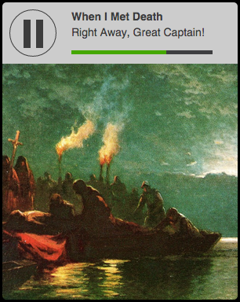

# Week 5 Final Exercise

It's Friday and we've had a hard week learning lots of new things. Hopefully the Tinder app we just developed has yielded an interesting date for tonight (rumor has it that Lando Calrissian has a special guest for dinner!) What we need now is to create the right atmosphere… how about putting on some music?!

### Enter the Spotify API

Spotify loves developers. That's why they have an [open free web API](https://developer.spotify.com/web-api/) that let's you access artists, albums and even 30 seconds of any song!

## Exercise: Spotify Mini Player

With what you've learnt so far, build a web app adapted for handhelds that will let the user search for a song and play it.

### 1. Git & Github

We will be following the [Github Flow](https://guides.github.com/introduction/flow/).

1. Create an empty project folder and start a git repository. Set a remote repository in Github.
2. Create a branch called `develop` and commit to that branch.
3. Open a Pull Request so we can all see the changes and comment.
4. Create atomic commits with meaningful messages. Review the comments and ammend them.

Use the following folder structure:
```
src/
  styles/*.css
  javascript/*.js
  images/*.png
  index.html
build/
  images/*.png
  application.js
  styles.css
  index.html
```

Remember to `.gitignore` files and folders that don't need to be in the remote repository.

### 2. Grunt.js

Use Grunt.js for taks.

1. `npm init`, `npm install grunt --save-dev` and create `Gruntfile.js`
2. Follow [Chris Coyier's tutorial](http://24ways.org/2013/grunt-is-not-weird-and-hard/) to set up basic tasks and the `watch` automator. [Thank me later](https://github.com/gruntjs/grunt-contrib-watch). (Some things may be old, check the latest documentation for each of the npm packages mentioned.)

### 3. Code!

1. Use only Vanilla Javascript (no jQuery allowed).
2. Do not use an MVC framework. No Angular! This is a really simple, one-page app.
3. You can use Bootstrap, although it is not really needed. Use CSS or LESS/SASS, whatever you prefer.
4. Code for mobile browsers (meta tags).
5. Use the following API Endpoints:
    * `https://api.spotify.com/v1/search` to search for `type=track`
    * `https://api.spotify.com/v1/tracks/{id}` to get a track's info and audio file.
6. Use the code shown at the Appendix for the player.
7. Use [HTML5 media events](https://developer.mozilla.org/en-US/docs/Web/Guide/Events/Media_events) to update the progress bar or the status of the play/pause button.
8. Use a search form to search and display the results on a list. When a song is clicked/tapped it starts reproducing and shows info and album cover in the player.

### 4. Deploy

1. Use `grunt-gh-pages` to deploy your app to Github Pages.
2. Test the app on a smartphone.

### 5. Refactoring and Bower Package (Optional)

Still got time left? No worriez.

1. Refactor your JavaScript code into an API which defines generic functions to use the Spotify API.
2. Use the Design Patterns we have seen. Ask the teacher and TIs for advice on how to refactor your current code.
3. Package it in a Bower package and make it pubicly available (in a separate Github repository.) Extra points if you use git tags for versioning.
4. Use this package in your app with Bower instead of the current code.

### Appendix: Code for Player

```html
<div class="widget">
  <div class="header">
    <div class="btn-play disabled"></div>

    <div class="metadata">
      <p class="title">Song title</p>
      <p class="author">Song author</p>

      <div class="seekbar">
        <progress value="1" max="30"></progress>
      </div>
    </div>
  </div>
  <div class="cover">
    
  </div>

  <audio id="audio"></audio>
</div>
```

```css

.widget {
  width: 300px;
  margin: 10px auto 0;
  border-radius: 5px;
  overflow: hidden;
  display: block;
}

.header {
  height: 78px;
  background-color: #ccc;
  position: relative;
  font-size: 12px;
}

.btn-play {
  margin: 9px;
  width: 60px;
  height: 60px;
  float: left;
  border-radius: 50px;
  border: 1px solid #3c3c3c;
  user-select: none;
  -webkit-user-select: none;
}

.btn-play:after {
  content: ' ';
  position: relative;
  display: block;
  width: 0px;
  height: 0px;
  margin-left: 50%;
  margin-top: 50%;
  left: -10px;
  top: -18px;
  border-top: 18px solid transparent;
  border-bottom: 18px solid transparent;
  border-left: 30px solid #3c3c3c;
}

.btn-play:hover {
  cursor: pointer;
  border-color: #666;
}

.btn-play:hover:after {
  border-left-color: #666;
}

.btn-play:active:after {
  border-left-color: #000;
}

.btn-play.playing:before, .btn-play.playing:after {
  width: 9px;
  height: 36px;
  background-color: #3c3c3c;
  position: absolute;
  content: "";
  top: 22px;
  left: 27px;
  border: 0;
  margin: 0;
}

.btn-play.playing:after {
  left: 43px;
}

.btn-play.playing:hover:before, .btn-play.playing:hover:after {
  background-color: #666;
}

.btn-play.playing:active:before, .btn-play.playing:active:after {
  background-color: #000;
}

.btn-play.disabled {
  border-color: #888;
}

.btn-play.disabled:hover {
  cursor: auto;
}

.btn-play.disabled:after {
  border-left-color: #888;
}

.metadata {
  display: inline-block;
  padding: 10px;
  width: calc(100% - 100px);
}

.title, .author {
  overflow: hidden;
  text-overflow: ellipsis;
  -o-text-overflow: ellipsis;
  white-space: nowrap;
  margin: 0;
  line-height: 1.4em;
  height: 1.4em;
  font-size: 14px;
  font-weight: bold;
}

.author {
  font-weight: normal;
}

.seekbar {
  margin-top: 5px;
  width: 100%;
}

.cover {
  height: 300px;
  position: relative;
}

.cover img {
  max-width: 100%;
  max-height: 100%;
  position: absolute;
  left: 0;
  border: 0;
}

audio {
  display: none;
}

progress {
  width: 100%;
  height: 5px;
  padding: 0;
  background-color: #3e3e40;
  position: relative;
  border: 0;
  overflow: hidden;
}

progress::-webkit-progress-bar {
  background-color: #3e3e40;
}

progress::-webkit-progress-value {
  background-color: #45a800;
}

progress::-moz-progress-bar {
  background-color: #45a800;
}
```

This is how it looks:

